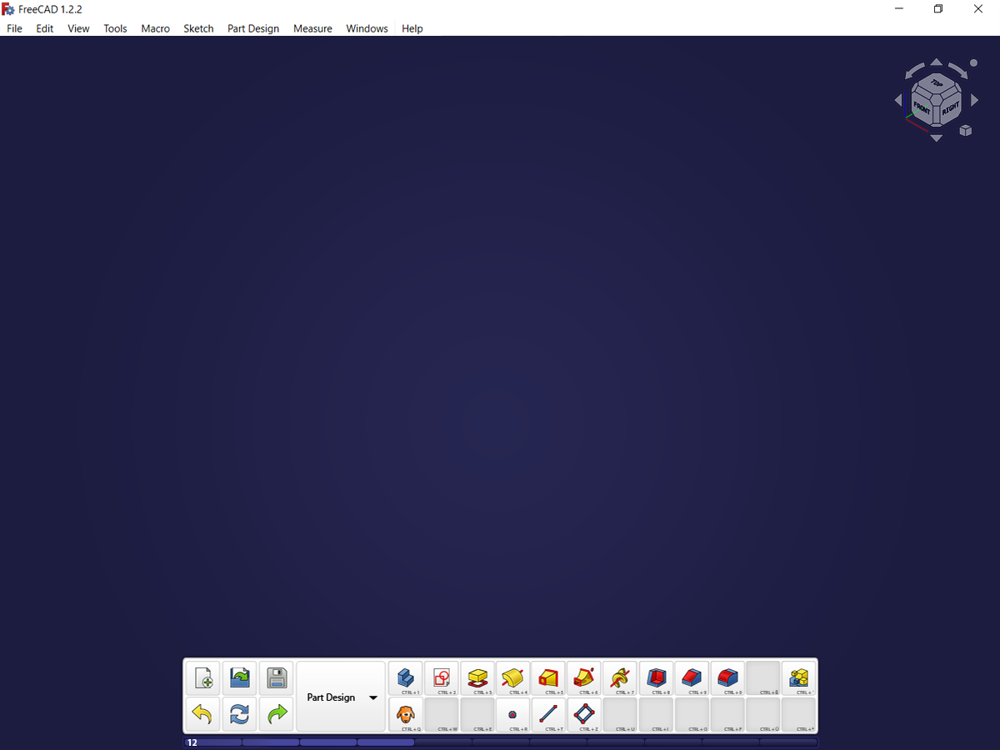

# FreeCAD-Action-Bar
FreeCAD faces the problem of displaying its vast number of functions in the GUI.

Modern MMORPGs (Massively Multiplayer Online Role Playing Games) face the same issue with displaying skills of the players character. 
These games have solved this issue by offering the user a collection of empty slots, usually arranged in a grid, where the user can insert their needed skills and arrange them to their liking. The slots also display keyboard shortcuts directly in the GUI. This solution is usually called an "action bar"

 Applying this solution to FreeCADs commands brings 3 unique advantages: :
1. Users get intuitively accustomed to keyboard shortcuts, which lets them work faster.
2. Users can create their own workflows by arranging a collection of commands they usually use. This can be extended to allow users to group functions form different workbenches. The workflows can be then also shared in the form of configurations.
3. Individual functions can be subsequently added by the system to the users action bar, enabling a way of gamifying the new user experience in FreeCAD. The user unlocks new functions after completing different tutorials. This gives the new user a sense of progression. Experienced users can turn the progression system off or dont even opt-in in the first place.

## Implementation steps
1. Display a grid of pyside2 components that can contain a button and detect a mouseover, lmb-up, lmb-down event.
2. Create a non modal dialog, containing all commands from the Part Design workbench. The pyside2 components for the commands detect a mouseover, lmb-down event.
3. Create a copy of the command icon with its container when command is picked up. The copy follows the mousecursor until dropped in the action bar or somewhere else.
4. Create a button with the dropped command in the actio nbar grid. It snaps to the grid-cells the mouse is over.
5. Launch command from the action bar
